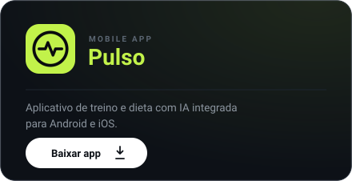
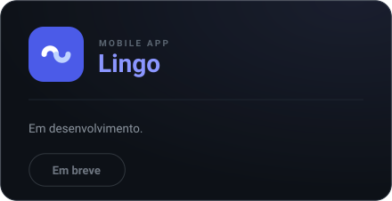

  

<h1 align="left">
  
</h1>

> **Engenheiro de IA & Software.** Eu gosto de transformar ideias em produtos que funcionam de verdade, do protótipo em notebook até o sistema rodando em produção. No dia a dia trabalho com modelos de Machine Learning, integrações com LLMs e o stack completo por trás: APIs, banco, infra, frontend. O que me move é escrever código bem feito que resolve problemas de gente real.

  
  
  
  

  
  
  
  

## 🛠️ Languages & Tools

  

## 🎖️ Certifications
<!--START_SECTION:badges-->

<!--END_SECTION:badges-->

## 🚀 Featured Projects

  
  

